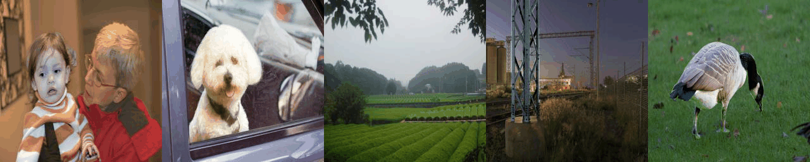

# DoveNet: Deep Image Harmonization via Domain Verification

by Wenyan Cong, Jianfu Zhang, Li Niu, Liu Liu, Zhixin Ling, Weiyuan Li and Liqing Zhang

CVPR2020

## Introduction
In this repository, we release the  PyTorch implementation and model of [DoveNet: Deep Image Harmonization via Domain Verification](). 

<br>

<br>

## Talks and Slides

[keynote]() | [slides]() | [video]()

## Prerequisites
- Linux
- Python 3
- CPU or NVIDIA GPU + CUDA CuDNN

## Getting Started
### Installation

- Clone this repo:
```bash
git clone https://github.com/bcmi/Image_Harmonization_Datasets.git
cd Image_Harmonization_Datasets
```

- Download the iHarmony4 dataset.
- Install [PyTorch](http://pytorch.org) 1.2  and other dependencies (e.g., torchvision, [visdom](https://github.com/facebookresearch/visdom) and [dominate](https://github.com/Knio/dominate)).
  - For Conda users,  you can create a new Conda environment using `conda env create -f environment.yaml`.

### DoveNet train/test
- To view training results and loss plots, run `python -m visdom.server` and click the URL http://localhost:8097.
- Train a model:
```bash
#!./scripts/train_dovenet.sh
python train.py  --dataset_root <path_to_iHarmony4_dataset> --name experiment_name  --model dovenet --dataset_mode iharmony4 --is_train 1  --gan_mode wgangp  --norm instance --no_flip --preprocess none --netG s2ad
```
Remember to specify `dataset_root` and `name` in the corresponding place.

To see more intermediate results, you can check out visdom or `./checkpoints/experiment_name/web/index.html`.

- Test the model:
```bash
#!./scripts/test_dovenet.sh
python test.py --dataset_root <path_to_iHarmony4_dataset> --name experiment_name --model dovenet --dataset_mode iharmony4 --netG s2ad --is_train 0  --norm instance --no_flip --preprocess none --num_test 7404
```

Remember to specify `dataset_root` and `name` in the corresponding places.

When testing, it prints the results of evaluation metrics MSE and PSNR. It also saves the harmonized outputs in `./results/experiment_name/latest_test/images/`

### Apply a pre-trained DoveNet model

Our pre-trained model is available on  [**Baidu Cloud**](https://pan.baidu.com/s/12oGrBF88O-x0BlWGVkMjag) (access code: 8q8a) [**(Alternative_address)**](https://bcmi.cloud:5001/sharing/WQkB0OnXK). Download and save it at `./checkpoints/experiment_name_pretrain/latest_net_G.pth`. 

As both instance normalization and batch normalization perform well for our task,  the model we provided here is the one using batch normalization.

To test its performance on iHarmony4 dataset, using:

```bash
python test.py --dataset_root <path_to_iHarmony4_dataset> --name experiment_name_pretrain --model dovenet --dataset_mode iharmony4 --netG s2ad --is_train 0  --norm batch --no_flip --preprocess none --num_test 7404
```

Note to specify `dataset_root` and `name` in the corresponding place.

The expected quantitative results is as the following table. The expected results of our released model are slightly different from those reported in our paper as we are releasing an overall better model.

|      | HCOCO | HAdobe5k | HFlickr | Hday2night | iHarmony4 |
| :--: | :---: | :------: | :-----: | :--------: | :-------: |
| MSE  | 33.65 |  55.99   | 125.73  |   56.26    |   50.87   |
| PSNR | 35.95 |  34.26   |  30.58  |   34.76    |   34.83   |

## BibTex

If you use this code for your research, please cite our paper using the following BibTeX [[preprint](https://arxiv.org/abs/1911.13239)]:

```
@inproceedings{DoveNet2020,
title={DoveNet: Deep Image Harmonization via Domain Verification},
author={Wenyan Cong and Jianfu Zhang and Li Niu and Liu Liu and Zhixin Ling and Weiyuan Li and Liqing Zhang},
booktitle={CVPR},
year={2020}}
```

## Acknowledgements

Code borrows heavily from [pix2pix](https://github.com/junyanz/pytorch-CycleGAN-and-pix2pix).