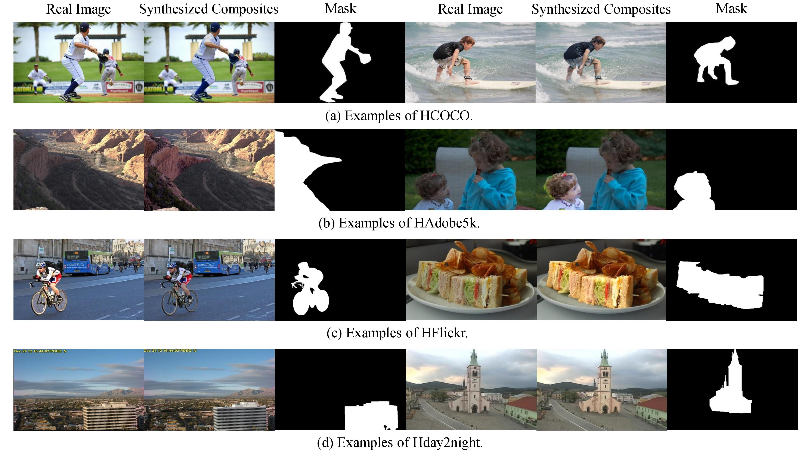

# Image_Harmonization_Datasets

**Image Harmonization** is to harmonize a composite image by adjusting its foreground appearances consistent with the background region. A real composite image is generated by a foreground region of one image combined with the background of another image. Though it's easy to create real composite images, the harmonized outputs are too time-consuming and skill-demanding to generate. So there is no available dataset.

Our dataset is a synthesized dataset for Image Harmonization. It contains 4 sub-datasets: HCOCO, HAdobe5k, HFlickr, and Hday2night, each of which contains synthesized composite images, foreground masks of composite images and corresponding real images. 

| |HCOCO|HAdobe5k|HFlickr|Hday2night|
|:--:|:--:|:--:|:--:|:--:|
|Traning set| 38545 |19437| 7449 |311|
|Test set| 4283 |2160| 828 |133|

- ### HCOCO

HCOCO, containing 50k synthesized composite images, is generated based on [Microsoft COCO](<http://cocodataset.org/>) dataset. The foreground region is corresponding object segmentation mask provided from COCO. Within the foreground region, the appearance of COCO image is edited using various color transfer methods. The dataset and training/testing split are provided in [Baidu Cloud](<https://pan.baidu.com/s/1mVc5NetjMRQkG5FWPwul2w>)

- ### HAdobe5k

HAdobe5k is generated based on [MIT-Adobe FiveK](<http://data.csail.mit.edu/graphics/fivek/>) dataset. Provided with 6 editions of the same image, we manually segment the foreground region and exchange foregrounds between 2 versions. The dataset and training/testing split are provided in [Baidu Cloud](<https://pan.baidu.com/s/1f65mUNc0i9wNTr5_kJI8rw>)

- ### HFlickr

We collected 5460 images from [Flickr](<https://www.flickr.com/>). After manually segmenting the foreground region, we use the same method as HCOCO to generate HFlickr sub-dataset. The dataset and training/testing split are provided in [Baidu Cloud](<https://pan.baidu.com/s/1AW2eZ3mcxQYeMEKIDPf6Qw>) 

- ### Hday2night

Hday2night is generated based on [day2night](https://pan.baidu.com/s/1bCtVhhtb_EDool_UnN2Bjw) dataset. We manually segment the foreground region, which is cropped and overlaid on another image captured on a different time. The dataset and training/testing split are provided in [Baidu Cloud](<https://pan.baidu.com/s/1Oqizfr66-HySDqrh58m61Q>)

