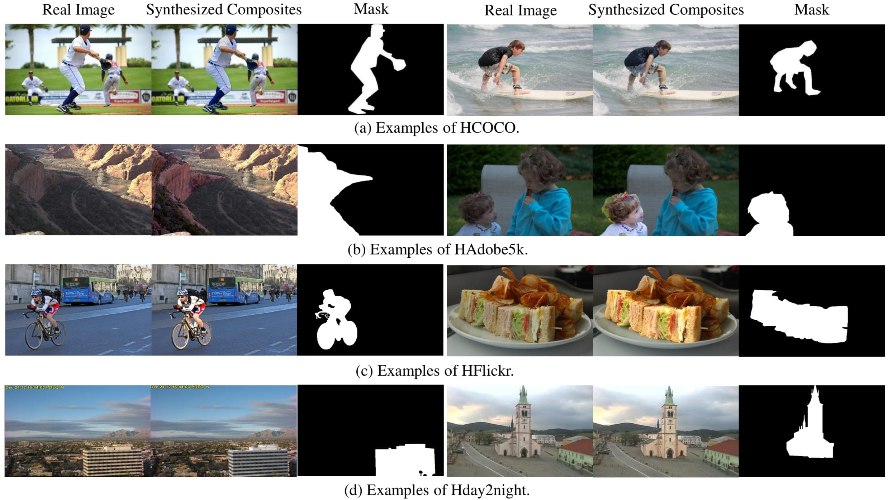
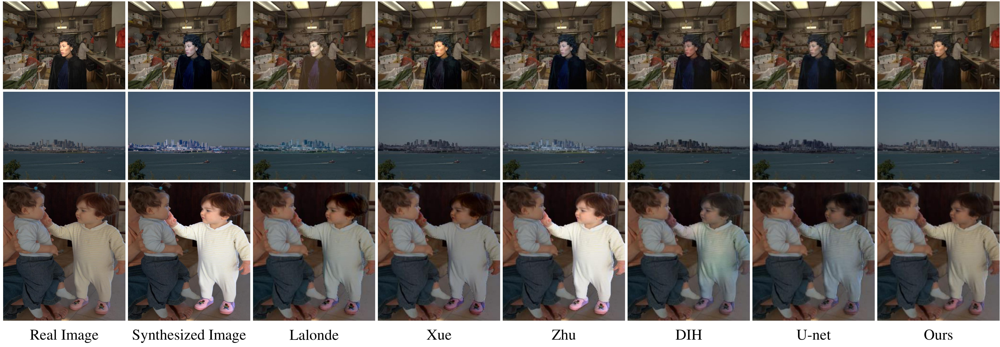
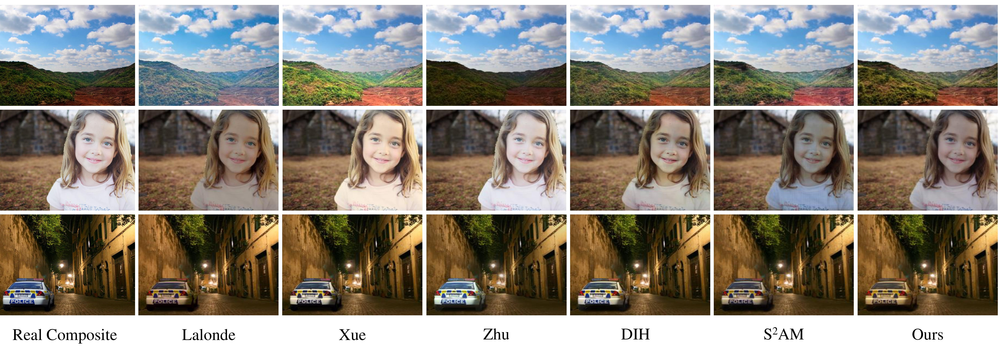

<base target="_blank"/>

# Image_Harmonization_Datasets: iHarmony4


**Image Harmonization** is to harmonize a composite image by adjusting its foreground appearances consistent with the background region. A real composite image is generated by a foreground region of one image combined with the background of another image. Though it's easy to create real composite images, the harmonized outputs are too time-consuming and skill-demanding to generate. So there is no high-quality publicly available dataset for image harmonization.

Our dataset **iHarmony4** is a synthesized dataset for Image Harmonization. It contains 4 sub-datasets: **HCOCO**,**HAdobe5k**, **HFlickr**, and **Hday2night**, each of which contains synthesized composite images, foreground masks of composite images and corresponding real images. The iHarmony4 dataset is provided in  [**Baidu Cloud**](<https://pan.baidu.com/s/1DaepFq0l8XHiG8dhQr8EBw>) [**(Alternative_address)**](https://bcmi.cloud:5001/sharing/Kc3eFVFix)

| |HCOCO|HAdobe5k|HFlickr|Hday2night|iHarmony4 |
|:--:|:--:|:--:|:--:|:--:|:--:|
|Training set| 38545 |19437| 7449 |311|65742|
|Test set| 4283 |2160| 828 |133|7404|

### 1. HCOCO

HCOCO, containing 42k synthesized composite images, is generated based on [Microsoft COCO](<http://cocodataset.org/>) dataset. The foreground region is corresponding object segmentation mask provided from COCO. Within the foreground region, the appearance of COCO image is edited using various color transfer methods. **The HCOCO sub-dataset and training/testing split are provided in [Baidu Cloud](https://pan.baidu.com/s/1b7MQDLI1n0FlnW7059KjQA)**(access code: yhh7)  [**(Alternative_address)**](https://bcmi.cloud:5001/sharing/KOBUL3QOs).


### 2. HAdobe5k

HAdobe5k is generated based on [MIT-Adobe FiveK](<http://data.csail.mit.edu/graphics/fivek/>) dataset. Provided with 6 editions of the same image, we manually segment the foreground region and exchange foregrounds between 2 versions. **The HAdobe5k sub-dataset and training/testing split are provided in [Baidu Cloud](https://pan.baidu.com/s/1NAtLnCdY1-4uxRKB8REPQg)** [**(Alternative_address)**](https://bcmi.cloud:5001/sharing/xxpHXApjV).


### 3. HFlickr

We collected 4833 images from [Flickr](<https://www.flickr.com/>). After manually segmenting the foreground region, we use the same method as HCOCO to generate HFlickr sub-dataset. **The HFlickr sub-dataset and training/testing split are provided in [Baidu Cloud](https://pan.baidu.com/s/1ZaCYo9Z21RGVgCwXgtvmbw)** [**(Alternative_address)**](https://bcmi.cloud:5001/sharing/SpeAHYMMT).


### 4. Hday2night

Hday2night is generated based on [day2night](https://pan.baidu.com/s/1bCtVhhtb_EDool_UnN2Bjw) dataset. We manually segment the foreground region, which is cropped and overlaid on another image captured on a different time. **The Hday2night sub-dataset and training/testing split are provided in [Baidu Cloud](https://pan.baidu.com/s/1wTqGeB9SMweS5UAaxWof8A)** [**(Alternative_address)**](https://bcmi.cloud:5001/sharing/bQnyVoPwF).




# Color Transfer Methods

To generate synthesized composite images, color transfer methods are adopted to transfer color information from reference images to real images. Considering that color transfer methods can be categorized into four groups based on parametric/non-parametric and correlated/decorrelated color space, we select one representative method from each group. Thanks to Wei Xu's efforts for releasing the code of color transfer method 1, 2 and 3 in their survey paper, we could implement color transfer methods specialized for foreground based on their implementation. And the source code of IDT regrain color transfer is downloaded from the author's [GitHub](https://github.com/frcs/colour-transfer)

### 1. global color transfer

--Parametric method in decorrelated color space. Implementation of paper "*Color transfer between images*" [[pdf]](https://www.cs.tau.ac.il/~turkel/imagepapers/ColorTransfer.pdf).

### 2. global color transfer in RGB color space

--Parametric method in correlated color space. Implementation of paper "*Color transfer in correlated color space*" [[pdf]](http://citeseerx.ist.psu.edu/viewdoc/download?doi=10.1.1.530.2757&rep=rep1&type=pdf).

### 3. cumulative histogram mapping

--Non-parametric method in decorrelated color space. Implementation of paper  ""*Histogram-based prefiltering for luminance and chrominance compensation of multiview video*" [[pdf]](https://ieeexplore.ieee.org/document/4539698).

### 4. IDT regrain color transfer

--Non-parametric method in correlated color space. Implementation of paper  "*Automated colour grading using colour distribution transfer*" [[pdf]](http://citeseerx.ist.psu.edu/viewdoc/download?doi=10.1.1.458.7694&rep=rep1&type=pdf).

# Our DoveNet

Here we provide PyTorch implementation and the trained model of our DoveNet.

## Prerequisites

- Linux
- Python 3
- CPU or NVIDIA GPU + CUDA CuDNN

## Getting Started

### Installation

- Clone this repo:

```bash
git clone https://github.com/bcmi/Image_Harmonization_Datasets.git
cd Image_Harmonization_Datasets
```

- Download the iHarmony4 dataset.
- Install [PyTorch](http://pytorch.org) 1.2  and other dependencies (e.g., torchvision, [visdom](https://github.com/facebookresearch/visdom) and [dominate](https://github.com/Knio/dominate)).
  - For Conda users,  you can create a new Conda environment using `conda env create -f environment.yaml`.

### DoveNet train/test

- To view training results and loss plots, run `python -m visdom.server` and click the URL http://localhost:8097.
- Train a model:

```bash
#!./scripts/train_dovenet.sh
python train.py  --dataset_root <path_to_iHarmony4_dataset> --name experiment_name  --model dovenet --dataset_mode iharmony4 --is_train 1  --gan_mode wgangp  --norm instance --no_flip --preprocess none --netG s2ad
```

Remember to specify `dataset_root` and `name` in the corresponding place.

To see more intermediate results, you can check out visdom or `./checkpoints/experiment_name/web/index.html`.

- Test the model:

```bash
#!./scripts/test_dovenet.sh
python test.py --dataset_root <path_to_iHarmony4_dataset> --name experiment_name --model dovenet --dataset_mode iharmony4 --netG s2ad --is_train 0  --norm instance --no_flip --preprocess none --num_test 7404
```

Remember to specify `dataset_root` and `name` in the corresponding places.

When testing, it prints the results of evaluation metrics MSE and PSNR. It also saves the harmonized outputs in `./results/experiment_name/latest_test/images/`

### Apply a pre-trained DoveNet model

Our pre-trained model is available on [**Baidu Cloud**](https://pan.baidu.com/s/12oGrBF88O-x0BlWGVkMjag) (access code: 8q8a) [**(Alternative_address)**](https://bcmi.cloud:5001/sharing/WQkB0OnXK). Download and save it at `./checkpoints/experiment_name_pretrain/latest_net_G.pth`. 

As both instance normalization and batch normalization perform well for our task,  **the model we provided here is the one using batch normalization**.

To test its performance on iHarmony4 dataset, using:

```bash
python test.py --dataset_root <path_to_iHarmony4_dataset> --name experiment_name_pretrain --model dovenet --dataset_mode iharmony4 --netG s2ad --is_train 0  --norm batch --no_flip --preprocess none --num_test 7404
```

Note to specify `dataset_root` and `name` in the corresponding place.

# Baselines

Here, we provide the code of baselines used in our paper "**DoveNet: Deep Image Harmonization via Domain Verification**", which is accepted by **CVPR2020**.  Refer to [Bibtex](#Bibtex) for more details.

### 1. Lalonde and Efros

J.-F. Lalonde et al. provides their implementation of paper  "*Using color compatibility for assessing image realism*" (ICCV2017) in their [GitHub](https://github.com/jflalonde/colorRealism).

And we have arranged the code to a "click-and-run" way. 
`demo.m` is available in `/lalonde/colorStatistics/mycode/demo/`. 
Don't forget to specify the path of the code and results in your computer in `getPathName.m`, and run `setPath.m` before run `demo.m`to get everything ready.

### 2. Xue *et al.*

This is Xue's implementation of their paper in 2012 ACM Transactions on Graphics "*Understanding and improving the realism of image composites*".

`demo.m` is available in `/xue/demo/`. 

Notice to add the path of all dependent files using `addpath(genpath('../dependency'))`.

### 3. Zhu *et al.*

Jun-Yan Zhu released the code of their paper "*Learning a discriminative model for the perception of realism in composite images*" (ICCV2015) in their [GitHub](<https://github.com/junyanz/RealismCNN>).

Notice that it requires matcaffe interface. We make some changes corresponds to our dataset including how to preprocess data and how to save the harmonized results. Don't forget to specify `DATA_DIR`,`MODEL_DIR` and `RST_DIR` before running `demo.m`.

The pre-trained models of Zhu's work can also be found in [BaiduCloud](https://pan.baidu.com/s/1_9UidT1rGNX0gYOYzjqITQ) and remember to put it under `MODEL_DIR`.

### 4. DIH

Tsai released their pre-trained caffe model of their paper "*Deep Image Harmonization*" (CVPR2017)  in their [GitHub](<https://github.com/wasidennis/DeepHarmonization>). This is a Tensorflow implementation based on the released caffe network.

Besides, we discard one inner-most convolutional layer and one inner-most deconvolutional layer to make it suitable for input of 256\*256 size. In DIH, they proposed to use segmentation branch to help propogate semantics to harmonization branch and it contributes considerable improvments. So here we inplement this two versions, DIH without  segmentation branch and  DIH with segmentation branch, corresponding to DIH(w/o semantics) and DIH in their paper.

   - #### without  segmentation branch

We discard the scene parsing branch and preserve the remaining encoder-decoder structure and skip links.  And this is the version used as one of the baselines in our paper.

To train DIH(w/o semantics) , under the folder `wo_semantics/`, run: 

`python train.py --data_dir <Your Path to Dataset> --init_lr 0.0001 --batch_size 32`

Don't forget to specify the directory of Image Harmonization Dataset after `data_dir`.

Our trained model can be found in [BaiduCloud](https://pan.baidu.com/s/1Uxf-bxJLh5W_TJbFl_cqOw). To test and re-produce the results, remember to put the model under `/dih/wo_semantics/model/` and run:

`python test.py --batch_size 1`

   - #### with segmentation branch

The structure is implemented the same as the Caffe network. In DIH, to pre-train the joint network, they constructed a synthesized composite dataset based on ADE20K, which provides images segmentations. While  we use HCOCO instead, leveraging existing segmentaitons of COCO images from COCO-Stuff dataset [GitHub](https://github.com/nightrome/cocostuff).  In our experiment, we leverage the object segmentations to pretrain the network. After downloading the dataset, preprocess the PNG segmentation to filter out stuff labels. Remember to rename the corresponding segmentation with the same name as real images and put them under `<Your Path to Dataset>/HCOCO/object_segmentations/`. Then, we freeze the segmentation branch and finetune harmonization branch using the whole dataset. 

To pre-train this model, under the folder `with_semantics/`, run:

`python train_seg.py --data_dir <Your Path to Dataset> --init_lr 0.0001 --batch_size 32`

After that, freeze the segmentation branch and finetune harmonization branch. Run:

`python finetune.py --data_dir <Your Path to Dataset> --init_lr 0.0001 --batch_size 32 --pretrain False`

Specify the directory of Image Harmonization Dataset after `data_dir`.

Our trained model can be found in [BaiduCloud](https://pan.baidu.com/s/1mUCNsT-3yAN6JHoPiNp9Xg). To test and re-produce the results, remember to put the model under `/dih/with_semantics/model/` and run:

`python test_seg.py --batch_size 1`


### 5. U-Net+attention

The code is implemented based on the work of CVPR 2017: Image-to-Image Translation with Conditional Adversarial Networks, which is released by Jun-Yan Zhu in their [GitHub](<https://github.com/junyanz/pytorch-CycleGAN-and-pix2pix>)

Since our dataset is not organized like a normally aligned dataset, we have to implement image loading and processing part according to our dataset. For more details, you could refer to `data/ihd_dataset.py`. We implement the U-net backbone based on Zhu's implementation of unet_256 and leverage attention blocks to enhance U-Net, which could be found in our Supplementary material.  In total, we insert three attention blocks into U-Net. Refer to `unetatt_model.py` for more details.

To train U-net+attention:

`python train.py  --dataroot ./datasets/ihd/ --name unetatt --model unetatt --gpu_ids 1 --dataset_mode ihd --is_train 1 --no_flip --preprocess none --norm instance`

Our trained model can be found in [BaiduCloud](https://pan.baidu.com/s/173AI769zl_VITMdgqwPBeQ).  Download and put it under `./unetatt/checkpoint/unetatt/` To test and re-produce the results of `U-net+att` , run:

`python test.py  --dataroot ./datasets/ihd/ --name unetatt --model unetatt --gpu_ids 1 --dataset_mode ihd --is_train 0 --no_flip --preprocess none --norm instance`

# Experiments

When conducting experiments, we merge training sets of four sub-datasets as a whole training set to train the model, and evaluate it on the test set of each sub-dataset and the whole test set. Here we show the results of recent baselines on our iHarmony4 dataset based on MSE and PSNR metrics.

<table class="tg">
  <tr>
    <th class="tg-0pky" align="center">Sub-dataset</th>
    <th class="tg-0pky" colspan="2" align="center">HCOCO</th>
    <th class="tg-0pky" colspan="2" align="center">HAdobe5k</th>
    <th class="tg-0pky" colspan="2" align="center">HFlickr</th>
    <th class="tg-0pky" colspan="2" align="center">Hday2night</th>
    <th class="tg-0pky" colspan="2" align="center">All</th>
  </tr>
  <tr>
    <th class="tg-0pky" align="center">Evaluation metric</th>
    <th class="tg-0pky" align="center">MSE</th>
    <th class="tg-0pky" align="center">PSNR</th>
    <th class="tg-0pky" align="center">MSE</th>
    <th class="tg-0pky" align="center">PSNR</th>
    <th class="tg-0pky" align="center">MSE</th>
    <th class="tg-0pky" align="center">PSNR</th>
    <th class="tg-0pky" align="center">MSE</th>
    <th class="tg-0pky" align="center">PSNR</th>
    <th class="tg-0pky" align="center">MSE</th>
    <th class="tg-0pky" align="center">PSNR</th>
  </tr>
  <tr>
    <td class="tg-0pky" align="center">input composite</td>
    <td class="tg-0pky" align="center">69.37</td>
    <td class="tg-0pky" align="center">33.94</td>
    <td class="tg-0pky" align="center">345.54</td>
    <td class="tg-0pky" align="center">28.16</td>
    <td class="tg-0pky" align="center">264.35</td>
    <td class="tg-0pky" align="center">28.32</td>
    <td class="tg-0pky" align="center">109.65</td>
    <td class="tg-0pky" align="center">34.01</td>
    <td class="tg-0pky" align="center">172.47</td>
    <td class="tg-0pky" align="center">31.63</td>
  </tr>
  <tr>
    <td class="tg-0pky" align="center"><a href="http://vision.gel.ulaval.ca/~jflalonde/assets/pubs/papers/lalonde_iccv_07.pdf">Lalonde and Efros</a> [2017]</td>
    <td class="tg-0pky" align="center">110.10</td>
    <td class="tg-0pky" align="center">31.14</td>
    <td class="tg-0pky" align="center">158.90</td>
    <td class="tg-0pky" align="center">29.66</td>
    <td class="tg-0pky" align="center">329.87</td>
    <td class="tg-0pky" align="center">26.43</td>
    <td class="tg-0pky" align="center">199.93</td>
    <td class="tg-0pky" align="center">29.80</td>
    <td class="tg-0pky" align="center">150.53</td>
    <td class="tg-0pky" align="center">30.16</td>
  </tr>
  <tr>
    <td class="tg-0pky" align="center"><a href="https://graphics.cs.yale.edu/sites/default/files/2012sig_compositing.pdf">Xue et al.</a> [2012]</td>
    <td class="tg-0pky" align="center">77.04</td>
    <td class="tg-0pky" align="center">33.32</td>
    <td class="tg-0pky" align="center">274.15</td>
    <td class="tg-0pky" align="center">28.79</td>
    <td class="tg-0pky" align="center">249.54</td>
    <td class="tg-0pky" align="center">28.32</td>
    <td class="tg-0pky" align="center">190.51</td>
    <td class="tg-0pky" align="center">31.24</td>
    <td class="tg-0pky" align="center">155.87</td>
    <td class="tg-0pky" align="center">31.40</td>
  </tr>
  <tr>
    <td class="tg-0pky" align="center"><a href="https://www.cv-foundation.org/openaccess/content_iccv_2015/papers/Zhu_Learning_a_Discriminative_ICCV_2015_paper.pdf">Zhu et al.</a> [2012]</td>
    <td class="tg-0pky" align="center">79.82</td>
    <td class="tg-0pky" align="center">33.04</td>
    <td class="tg-0pky" align="center">414.31</td>
    <td class="tg-0pky" align="center">27.26</td>
    <td class="tg-0pky" align="center">315.42</td>
    <td class="tg-0pky" align="center">27.52</td>
    <td class="tg-0pky" align="center">136.71</td>
    <td class="tg-0pky" align="center">32.32</td>
    <td class="tg-0pky" align="center">204.77</td>
    <td class="tg-0pky" align="center">30.72</td>
  </tr>
  <tr>
    <td class="tg-0pky" align="center"><a href="https://openaccess.thecvf.com/content_cvpr_2017/papers/Tsai_Deep_Image_Harmonization_CVPR_2017_paper.pdf">DIH</a> [2017] w/o semantic</td>
    <td class="tg-0pky" align="center">51.85</td>
    <td class="tg-0pky" align="center">34.69</td>
    <td class="tg-0pky" align="center">92.65</td>
    <td class="tg-0pky" align="center">32.28</td>
    <td class="tg-0pky" align="center">163.38</td>
    <td class="tg-0pky" align="center">29.55</td>
    <td class="tg-0pky" align="center">82.34</td>
    <td class="tg-0pky" align="center">34.62</td>
    <td class="tg-0pky" align="center">76.77</td>
    <td class="tg-0pky" align="center">33.41</td>
  </tr>
  <tr>
    <td class="tg-0pky" align="center"><a href="https://openaccess.thecvf.com/content_CVPR_2020/papers/Cong_DoveNet_Deep_Image_Harmonization_via_Domain_Verification_CVPR_2020_paper.pdf">DoveNet</a> [2020]</td>
    <td class="tg-0pky" align="center">36.72</td>
    <td class="tg-0pky" align="center">35.83</td>
    <td class="tg-0pky" align="center">52.32</td>
    <td class="tg-0pky" align="center">34.34</td>
    <td class="tg-0pky" align="center">133.14</td>
    <td class="tg-0pky" align="center">30.21</td>
    <td class="tg-0pky" align="center">54.05</td>
    <td class="tg-0pky" align="center">35.18</td>
    <td class="tg-0pky" align="center">52.36</td>
    <td class="tg-0pky" align="center">34.75</td>
  </tr>
  <tr>
    <td class="tg-0pky" align="center"><a href="https://arxiv.org/pdf/1907.06406.pdf">S<sup>2</sup>AM</a> [2020]<sup>*</sup></td>
    <td class="tg-0pky" align="center">33.35</td>
    <td class="tg-0pky" align="center">35.96</td>
    <td class="tg-0pky" align="center">49.30</td>
    <td class="tg-0pky" align="center">35.00</td>
    <td class="tg-0pky" align="center">129.30</td>
    <td class="tg-0pky" align="center">30.88</td>
    <td class="tg-0pky" align="center">45.19</td>
    <td class="tg-0pky" align="center">35.44</td>
    <td class="tg-0pky" align="center">48.95</td>
    <td class="tg-0pky" align="center">35.10</td>
  </tr>
  <tr>
    <td class="tg-0pky" align="center"><a href="https://www.bmvc2020-conference.com/assets/papers/0121.pdf">Hao et al.</a> [2020]<sup>+</sup></td>
    <td class="tg-0pky" align="center">23.44</td>
    <td class="tg-0pky" align="center">37.33</td>
    <td class="tg-0pky" align="center">39.22</td>
    <td class="tg-0pky" align="center">34.80</td>
    <td class="tg-0pky" align="center">112.39</td>
    <td class="tg-0pky" align="center">31.29</td>
    <td class="tg-0pky" align="center">49.73</td>
    <td class="tg-0pky" align="center">36.96</td>
    <td class="tg-0pky" align="center">38.46</td>
    <td class="tg-0pky" align="center">35.91</td>
  </tr>
  <tr>
    <td class="tg-0pky" align="center"><a href="https://arxiv.org/pdf/2009.09169.pdf">BargainNet</a> [2021]</td>
    <td class="tg-0pky" align="center">24.84</td>
    <td class="tg-0pky" align="center">37.03</td>
    <td class="tg-0pky" align="center">39.94</td>
    <td class="tg-0pky" align="center">35.34</td>
    <td class="tg-0pky" align="center">97.32</td>
    <td class="tg-0pky" align="center">31.34</td>
    <td class="tg-0pky" align="center">50.98</td>
    <td class="tg-0pky" align="center">35.67</td>
    <td class="tg-0pky" align="center">37.82</td>
    <td class="tg-0pky" align="center">35.88</td>
  </tr>
  <tr>
    <td class="tg-0pky" align="center"><a href="https://openaccess.thecvf.com/content/WACV2021/papers/Sofiiuk_Foreground-Aware_Semantic_Representations_for_Image_Harmonization_WACV_2021_paper.pdf">iDIH256</a> [2021] w/o semantic<sup>#</sup></td>
    <td class="tg-0pky" align="center">19.58</td>
    <td class="tg-0pky" align="center">38.34</td>
    <td class="tg-0pky" align="center">30.84</td>
    <td class="tg-0pky" align="center">36.00</td>
    <td class="tg-0pky" align="center">84.74</td>
    <td class="tg-0pky" align="center">32.58</td>
    <td class="tg-0pky" align="center">50.05</td>
    <td class="tg-0pky" align="center">37.10</td>
    <td class="tg-0pky" align="center">30.70</td>
    <td class="tg-0pky" align="center">36.99</td>
  </tr>
  <tr>
    <td class="tg-0pky" align="center"><a href="https://openaccess.thecvf.com/content/WACV2021/papers/Sofiiuk_Foreground-Aware_Semantic_Representations_for_Image_Harmonization_WACV_2021_paper.pdf">iDIH256</a> [2021] w/ semantic</td>
    <td class="tg-0pky" align="center">14.01</td>
    <td class="tg-0pky" align="center">39.64</td>
    <td class="tg-0pky" align="center">21.36</td>
    <td class="tg-0pky" align="center">37.35</td>
    <td class="tg-0pky" align="center">60.41</td>
    <td class="tg-0pky" align="center">34.03</td>
    <td class="tg-0pky" align="center">50.61</td>
    <td class="tg-0pky" align="center">37.68</td>
    <td class="tg-0pky" align="center">22.00</td>
    <td class="tg-0pky" align="center">38.31</td>
  </tr> 
</table>

<font size=2.5>\*: Results of S<sup>2</sup>AM here are trained from scratch using the code from the official S<sup>2</sup>AM [GitHub](https://github.com/vinthony/s2am). In the GitHub, they also provide results trained on each sub-dataset individually, which we do not include here for fair comparison.</font>
<font size=2>\+: Results of Hao et al. here are tested using the released model from the official [GitHub](https://github.com/Dominoer/bmvc2020_image_harmonization) since they do not report MSE in their paper.</font>
<font size=2>\#: Results of iDIH backbone without auxiliary semantic information are copied from the official [GitHub](https://github.com/saic-vul/image_harmonization).</font>
<font size=2>Other results without any specifications are directly copied from our DoveNet or other published papers.</font>


Here we also show some example results of different baselines on our dataset. More examples can be found in our main paper.



Besides, to evaluate the effectiveness of different methods in real scenarios, we also conduct user study on 99 real composite images, of which 48 images from Xue and 51 images from Tsai. Below we present several results of different baselines on real composite images. The 99 real composite images could be found in [BaiduCloud](https://pan.baidu.com/s/1z0fvp28gWswSCysw0eiUQg). And to visualize the comparison, we have put the results of different methods on all 99 real composite images in Supplementary.



# Bibtex

**When using images from our dataset, please cite our paper using the following BibTeX  [[pdf](https://openaccess.thecvf.com/content_CVPR_2020/papers/Cong_DoveNet_Deep_Image_Harmonization_via_Domain_Verification_CVPR_2020_paper.pdf)] [[supp](https://openaccess.thecvf.com/content_CVPR_2020/supplemental/Cong_DoveNet_Deep_Image_CVPR_2020_supplemental.pdf)] [[arxiv](https://arxiv.org/abs/1911.13239)]:**

```
@inproceedings{DoveNet2020,
title={DoveNet: Deep Image Harmonization via Domain Verification},
author={Wenyan Cong and Jianfu Zhang and Li Niu and Liu Liu and Zhixin Ling and Weiyuan Li and Liqing Zhang},
booktitle={CVPR},
year={2020}}
```

